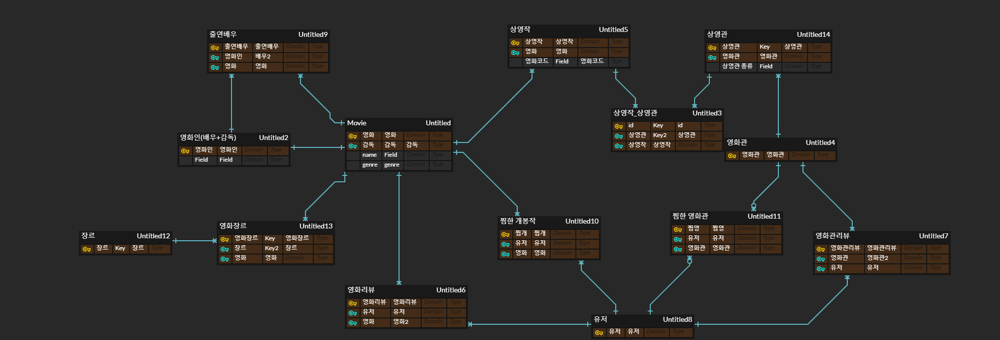

# 🚀우주씨

   

> SSAFY 심화 프로젝트 
>
> 실시간 상영 영화 정보 조회 서비스


- 🎢환상의 나라 A406 조에 오신것을 환영합니다

- 💕 우리 주변 씨네마
- 💕 Would you ci 


## 서비스 소개


### 배경

- 대형 3사 위주의 영화 생태계
  - 대형 3사의 경우, 어느 영화관에서 어떤 영화를 상영하는지에 대한 정보를 많이 제공하고 있으며, 사용자들은 이에 대한 정보를 손쉽게 얻을 수 있습니다.
  - 하지만 중, 소형 극장의 경우 사용자들에게 상영 정보를 알리는 것이 쉽지 않을 뿐만 아니라, 사용자들도 해당 정보를 얻기까지 많은 번거로운 단계를 거쳐야 합니다.
  - 이 때문에 저희는 대형 3사뿐만 아니라 중, 소형 영화관의 상영 정보까지 사용자들이 편하게 제공받을 수 있도록 서비스를 기획했습니다.


- 네이버 영화의 불편한 UI
  - 네이버 영화는 사용자 위치를 기반으로 주변 영화관과 영화의 정보를 제공하고는 있지만, 사용자들이 사용하기에 불편하며 UI도 예쁘지 않습니다.
  - 또한, 네이버 영화의 경우, 남은 좌석 수 등의 정보는 보여주지 않기 때문에 사용자는 근처의 영화관 중에서 어떤 영화관의 영화가 가장 많은 잔여 좌석을 가지고 있는지 알 수 없습니다. (운이 없다면 예매하려 하는 영화가 맨 앞줄밖에 남지 않아 사용자는 맨 앞줄을 선택해야 할지도 모릅니다.)
  - 이러한 불편함을 해소하기 위해 저희는 최대한 사용자의 입장에서 편하게 서비스를 사용할 수 있도록 와이어프레임을 작성하였으며, 영화관들의 위치, 빠른 상영작, 해당 영화의 실시간 잔여 좌석수 등 영화를 선택하는데 있어 중요한 정보들을 모두 사용자에게  한 번에 제공하고 있습니다.


### 우주씨(우리 주변 씨네마)


- 위치 기반
  - 사용자는 현재 자신의 위치를 기반으로 주변의 영화관들을 볼 수 있습니다.
  - 우주씨는 영화관을 클릭할 때마다 현재 시간을 기준으로 가장 빠른 상영작들을 보여줍니다.
  - 이때, 제공되는 정보들은 제목, 포스터, 상영관, 상영시간, 실시간 잔여좌석수, 전체 좌석수, 시청 등급 등이 있습니다.
  - 사용자들은 지도에서 해당 정보들을 비교해가며 쉽게 영화관 및 영화를 선택할 수 있습니다.
  - 마지막으로 지도에서 상영작을 누르면 예매 페이지를 띄워 사용자가 보다 편하게 예매 할 수 있도록 우주씨는 서비스를 제공하고 있습니다.


- 시간 및 장소 옵션
  - 우주씨는 기본적으로는 위에서처럼 현재 사용자의 위치를 기반으로 정보를 제공해줍니다.
  - 하지만 사용자가 꼭 지금 위치에서, 지금 시간의 영화를 궁금해한다는 보장이 없기 때문에, 시간과 장소 옵션을 따로 사용자에게 제공하고 있습니다.
  - 사용자는 시간을 선택하여 해당 시간 이후에 상영하는 영화 목록들만을 볼 수도 있고, 지도를 드래그 하여 궁금한 지역의 영화 및 영화관 정보를 제공받을 수도 있습니다.


- 영화/영화관 검색 및 정보 공유
  - 사용자들은 자신이 방문한 영화관 혹은 관람한 영화에 대해 댓글과 평점을 남길 수 있습니다.
  - 또한 사용자들이 남긴 댓글을 보고 영화관과 영화에 대한 정보를 얻을 수도 있습니다.
  - 우주씨는 사용자들의 보다 쉬운 검색을 위해 검색어 자동완성 기능도 제공하고 있습니다.


- 좋아요 기능과 찜하기
  - 사용자들은 위의 검색 기능을 바탕으로 자신이 좋아하는 영화 및 영화관에 대해 좋아요 버튼을 누를 수 있습니다.
  - 또한, 아직 개봉하지 않은 영화에 대해서는 좋아요 버튼 대신에 찜하기 버튼이 제공됩니다. 사용자가 아직 개봉하지 않은 영화를 찜하면, 이후에 해당 영화에 대해 예매가 열렸을 때 우주씨가 사용자들에게 push 알람을 통해 예매가 시작되었다는 것을 알려드립니다.
  - 좋아요와 찜한 목록들은 유저페이지에서 한 꺼번에 볼 수 있습니다.


- 빅데이터 분석 및 추천
  - 사용자가 최소 10개 이상의 작품에 대해 평가를 남기면 그 평점으로 우주씨가 사용자의 취향을 분석합니다.
  - 우주씨는 분석한 내용을 바탕으로 현재 상영작 중에서 영화를 추천해주기도 하고, 옛날 영화에 대해서도 추천을 해줍니다.
  - 또한, 우주씨는 영화 상세 페이지에 갔을 때, 해당 영화가 나의 취향과 얼마나 일치할지에 대해 일치도를 제공해주고 있습니다.


- PWA를 통한 유저 편의 극대화
  - 유저들은 PWA를 통해 우주씨를 다운받아 마치 APP 처럼 사용할 수 있습니다. 하지만 실제 APP보다 훨씬 적은 용량을 차지하며 APP과 같은 사용 경험을 제공합니다.
  - 이 덕분에 우주씨는 사용자들에게 push 알람을 통해 중요한 정보를 제공해줌으로써 서비스 재사용을 유도할 수 있습니다.
  - 이제 사용자들은 예매 오픈을 기다리며 영화관 홈페이지를 들락날락할 필요가 없습니다!


## Quick Start

- `./wouldyouci_back`

  ```
  venv 가상환경 설정 - python 3.7
  
  touch .env
  
  pip install requirements.txt
  
  python manage.py runserver
  ```

  

- `./wouldyouci`

  ```
  npm install
  
  touch .env
  
  npm run serve
  ```

  

## 기술 스택


### 프론트엔드

[front]: ./doc/front/front.md	"FrontEnd"


- doc 폴더 문서
  - 프로젝트 관리
  - 와이어프레임
  - [https 배포하기](.\doc\https_배포하기.md)

  - [REST_API](.\doc\REST_API.md) - notion backup (05.27)


- ERD

  

  
